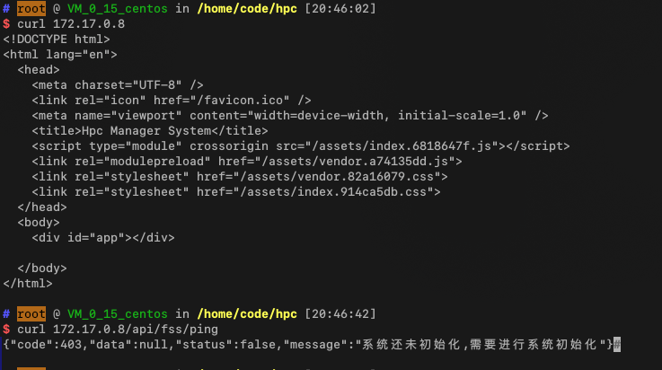
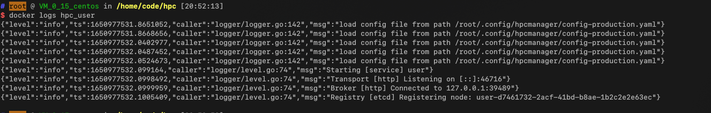
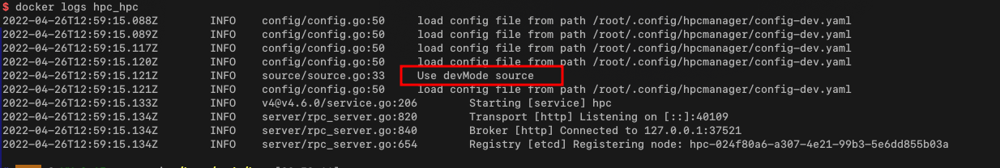
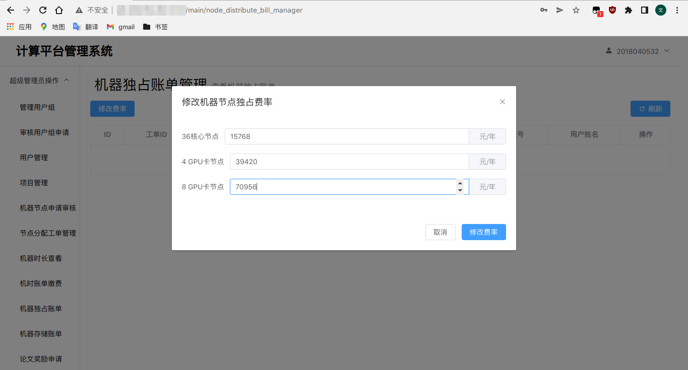
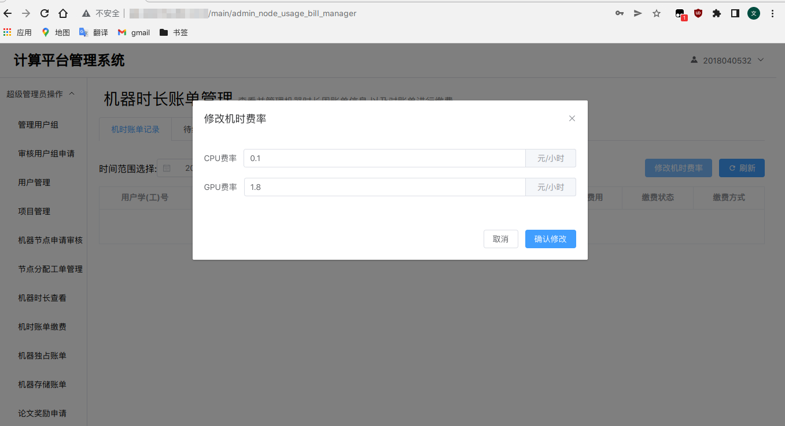
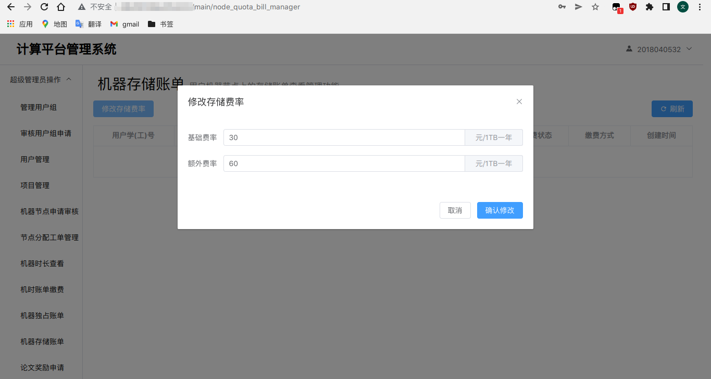

# 部署文档

# 概况

## docker镜像

项目总共10个业务相关的服务以及4个用作服务架构组成的服务。

服务详情见[README.md](../README.md)

其中的`fss`服务和`proxy`服务合并部署在一个docker内部，`hpc`服务由于需要直接调用计算节点的命令行工具，因此不使用docker部署，直接部署在计算节点本机上即可。因此共需要部署8个docker容器作为最基本的业务支撑。

其docker镜像名列表如下：

```text
hpcmanager/hpc
hpcmanager/node
hpcmanager/user
hpcmanager/fee
hpcmanager/project
hpcmanager/permission
hpcmanager/award
hpcmanager/gateway
hpcmanager/proxy
```

另外的4个用作服务架构的镜像分别为：

```text
docker.io/rabbitmq
docker.io/redis
docker.io/mysql
docker.io/bitnami/etcd
```

其中必须待这四个基础的服务启动完毕之后才可启动业务服务。

## 镜像环境变量

服务部署需要修改诸如数据库、注册中心、redis等的配置信息，镜像提供环境变量形式进行动态修改配置，8个业务所支持的环境变量列表如下：

1. `MYSQL_HOST` MySQL数据库IP地址
2. `MYSQL_PORT` MySQL数据库的端口
3. `MYSQL_DATABASE` 所使用的数据库名
4. `MYSQL_USERNAME` 所使用的数据库登录用户名
5. `MYSQL_PASSWORD` 所使用的数据库登录用户密码
6. `REDIS_ADDRESS` redis服务的地址以及端口
7. `ETCD_ADDRESS` etcd注册中心的地址
8. `RABBITMQ_ADDRESS` rabbitmq服务的fishier以及端口
9. `HPCMANAGER_ENV` 项目的环境变量值，默认值为`production`，一般不用变动，用来标名当前所处的环境，其中`hpc`服务在特有的`dev`环境下会进入开发模式，对于其他的服务来说`production`以及`development`环境下会有不同的日志行为
10. `GATEWAY_ADDRESS` 网关服务的地址以及端口，其为`proxy`服务特有的设置值，用来标识API网关的地址，目前只支持一个网关服务运行

## 数据库初始化

将项目根目录下的`mysql.sql`文件导入即可初始化项目数据库

# 部署示例

## 1. mysql服务

执行命令：`docker run -itd --name hpc_mysql -e MYSQL_ROOT_PASSWORD=hpcroot -v /home/code/hpc/mysql.sql:/docker-entrypoint-initdb.d/hpc.sql mysql:8.0`

通过将sql文件映射到`/docker-entrypoint-initdb.d`下自动初始化数据库。并初始化root用户的连接密码为`hpcroot`

通过`docker inspect hpc_mysql`命令可以获取到该容器对应的IP地址为:`172.17.0.3`

> 此为实验环境下，不同环境下的IP地址可能会有不同

## 2. redis服务

执行`docker run -itd --name hpc_redis redis`

其容器对应的IP地址为:`172.17.0.4`

## 3. etcd注册中心

直接执行:`docker run -itd --name hpc_etcd -e ALLOW_NONE_AUTHENTICATION=yes bitnami/etcd`

这里通过设置 `ALLOW_NODE_AUTHENTICATION=yes`取消掉`etcd`服务的连接需要鉴权

其IP地址为:`172.17.0.5`

**重要:**

由于项目使用了`etcd`作为动态配置中心,因此需要初始化`etcd`服务的某个值,用于动态配置注册

首先执行`docker exec -it hpc_etcd /bin/bash`进入容器内部

然后执行`etcdctl put /hpcmanager/micro/config ""`

然后`exit`退出即可

## 4. rabbitmq消息队列服务

直接执行：`docker run -itd --name hpc_rabbitmq rabbitmq:management`

其IP地址：`172.17.0.6`

## 5. 网关服务

执行命令:`docker run -itd --name hpc_gateway -e ETCD_ADDRESS=172.17.0.5 -e REDIS_ADDRESS=172.17.0.4:6379 hpcmanager/gateway:test`

将`etcd`和`redis`容器的地址传进去即可

其IP地址为:`172.17.0.7`

## 6. 代理服务

由于代理服务中包含了fss服务，所以也需要正确传递注册中心等地址，执行命令：

```shell
docker run -itd --name hpc_proxy -e MYSQL_HOST=172.17.0.3 \
                                -e MYSQL_USERNAME=root \     
                                -e MYSQL_PASSWORD=hpcroot \
                                -e ETCD_ADDRESS=172.17.0.5 \
                                -e REDIS_ADDRESS=172.17.0.4:6379 \
                                -e RABBITMQ_ADDRESS=172.17.0.6:5672 \
                                -e GATEWAY_ADDRESS=172.17.0.7 \
                                hpcmanager/proxy:1.0
```

> 在正式环境部署时候需要将容器的80端口映射出来供外界访问

此时容器的IP地址为:`172.17.0.8`

此时访问容器的80端口可看到静态资源以及网关服务均可被调用：



## 7. 用户服务

执行命令:

```shell
docker run -itd --name hpc_user -e MYSQL_HOST=172.17.0.3 \  
                               -e MYSQL_USERNAME=root \
                               -e MYSQL_PASSWORD=hpcroot \
                               -e ETCD_ADDRESS=172.17.0.5 \
                               -e REDIS_ADDRESS=172.17.0.4:6379 \
                               -e RABBITMQ_ADDRESS=172.17.0.6:5672 \
                               hpcmanager/user:1.0


```

设置数据库、注册中心、redis、rabbitmq的地址

等待一段时间执行`docker logs hpc_user`可以看到其成功注册进注册中心的日志，表明成功启动



## 8. 权限服务

执行命令:

```shell
docker run -itd --name hpc_permission -e MYSQL_HOST=172.17.0.3 \  
                               -e MYSQL_USERNAME=root \
                               -e MYSQL_PASSWORD=hpcroot \
                               -e ETCD_ADDRESS=172.17.0.5 \
                               -e REDIS_ADDRESS=172.17.0.4:6379 \
                               -e RABBITMQ_ADDRESS=172.17.0.6:5672 \
                               hpcmanager/permission:1.0


```

## 9. 机器节点服务

执行命令:

```shell
docker run -itd --name hpc_node -e MYSQL_HOST=172.17.0.3 \ 
                                -e MYSQL_USERNAME=root \
                                -e MYSQL_PASSWORD=hpcroot \
                                -e ETCD_ADDRESS=172.17.0.5 \
                                -e REDIS_ADDRESS=172.17.0.4:6379 \
                                -e RABBITMQ_ADDRESS=172.17.0.6:5672 \
                                hpcmanager/node:1.0    
```

## 10. 费用服务

执行命令:

```shell
docker run -itd --name hpc_fee -e MYSQL_HOST=172.17.0.3 \ 
                                -e MYSQL_USERNAME=root \
                                -e MYSQL_PASSWORD=hpcroot \
                                -e ETCD_ADDRESS=172.17.0.5 \
                                -e REDIS_ADDRESS=172.17.0.4:6379 \
                                -e RABBITMQ_ADDRESS=172.17.0.6:5672 \
                                hpcmanager/fee:1.0       
```

## 11. 项目服务

执行命令:

```shell
docker run -itd --name hpc_project -e MYSQL_HOST=172.17.0.3 \
                                -e MYSQL_USERNAME=root \
                                -e MYSQL_PASSWORD=hpcroot \
                                -e ETCD_ADDRESS=172.17.0.5 \
                                -e REDIS_ADDRESS=172.17.0.4:6379 \
                                -e RABBITMQ_ADDRESS=172.17.0.6:5672 \
                                hpcmanager/project:1.0
```

## 12. 奖励服务

执行命令:

```shell
docker run -itd --name hpc_award -e MYSQL_HOST=172.17.0.3 \ 
                                -e MYSQL_USERNAME=root \
                                -e MYSQL_PASSWORD=hpcroot \
                                -e ETCD_ADDRESS=172.17.0.5 \
                                -e REDIS_ADDRESS=172.17.0.4:6379 \
                                -e RABBITMQ_ADDRESS=172.17.0.6:5672 \
                                hpcmanager/award:1.0
```

## 13. 作业调度测试服务

此次示例中为测试环境下的部署流程，因此作业调度服务仍使用docker进行模拟部署

执行命令：

```shell
docker run -itd --name hpc_hpc -e MYSQL_HOST=172.17.0.3 \  
                                -e MYSQL_USERNAME=root \
                                -e MYSQL_PASSWORD=hpcroot \
                                -e ETCD_ADDRESS=172.17.0.5 \
                                -e REDIS_ADDRESS=172.17.0.4:6379 \
                                -e RABBITMQ_ADDRESS=172.17.0.6:5672 \
                                hpcmanager/hpc:1.0
```

待服务启动之后查看其日志：



其中的`Use devMode source`代表其正确进入了开发测试环境下

**部署生产环境下的hpc服务见附录**

# 部署后的系统初始化

系统成功部署需要进行初始化，不然访问所有接口都会出现以下的提示：


在浏览器中访问代理服务的80端口，会出现登录界面，但是此时系统还未初始化，无法进行登录

访问`http://地址/install`进入安装初始化界面，在这里初始化管理员账户的信息。


此处初始化为系统超级管理员，拥有最高级别的权限

初始化完毕后登录可以查看道当前所有服务的状态：


其中绿色代表服务状态正常，红色代表服务下线。

# 系统部分配置

## 1. 机器节点独占费率配置

超级管理员用户在机器独占账单管理界面可以进行配置



## 2. 机器包机时长费率配置

超级管理员用户可以在机器时长账单管理界面进行配置



## 3. 机器存储费率配置

超级管理员可以在机器存储账单页面进行配置



# 附录

## 1. 生产环境下的作业调度服务部署

